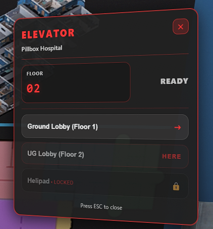

# bc_elevator

FiveM elevator system designed for roleplay servers.

## Features

- Multi-floor elevator system
- Configurable elevator locations
- Smooth UI interaction
- Optimized for RP servers

## Requirements / Dependencies

This resource requires the following dependencies:

- **ox_lib**
- **ox_target**

Make sure all dependencies are installed and started before this resource.

### server.cfg order

```cfg
ensure ox_lib
ensure ox_target
ensure bc_elevator
```

## In-Game Preview


